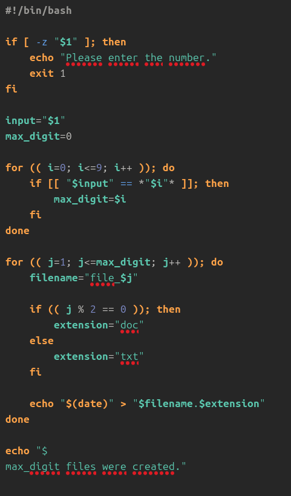

# Лабораторная работа №5
## Цель: в рамках ЛР 5 необходимо создать исполняемый файл в соответствии с заданным вариантом. 

Вариант 42: Создать файл sh и bat, который выполняет следующее: 
На вход пакетному файлу приходит число (как параметр пакетного файла). В данном числе найти самую максимальную цифру, создать ровно столько файлов с расширением txt, у каждого второго поменять расширение на doc и записать туда сегодняшнюю дату.

## Код для Windows:

### Основные моменты:

* `@echo off` - отключает вывод команд в консоль, чтобы сделать вывод более чистым;
* `set num=%1` - cохраняет первый аргумент, переданный скрипту, в переменной num;
* `/L` - ключ, запускающий цикл от start до end с заданным step;
* `/a` - ключ, отвечающий за выполнение математических операций
* `findstr` - ключ, занимающийся поиском строк, соответстыующих заданному шаблону.

## Код для Linux:

### Основные моменты:

* `#!/bin/bash` - это шебанг. Он говорит системе, что скрипт нужно выполнять с помощью интерпретатора Bash;
* `input = "$1"` - передает значение аргумента, введенное с клавиатуры;
* `extension` - устанавливает расширение для файла.

Материалы для написания скриптов, а также информацию по ним можно найти [тут](https://www.google.com/).
