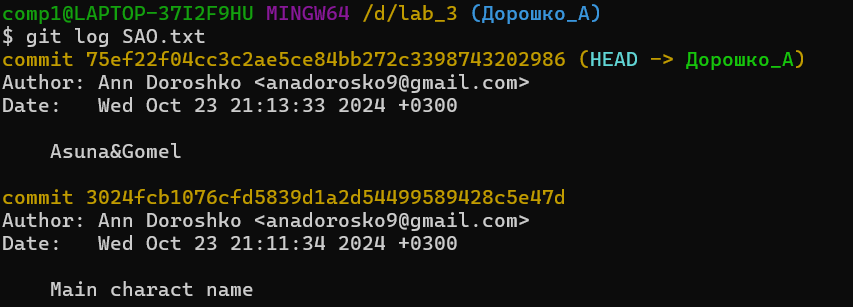
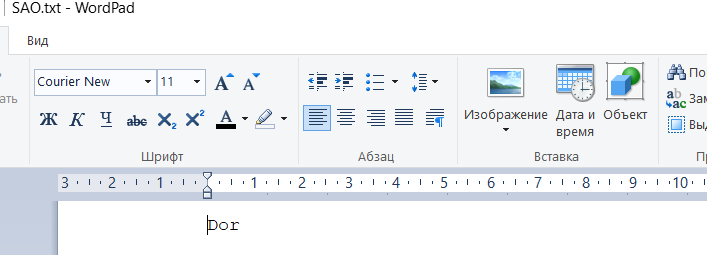
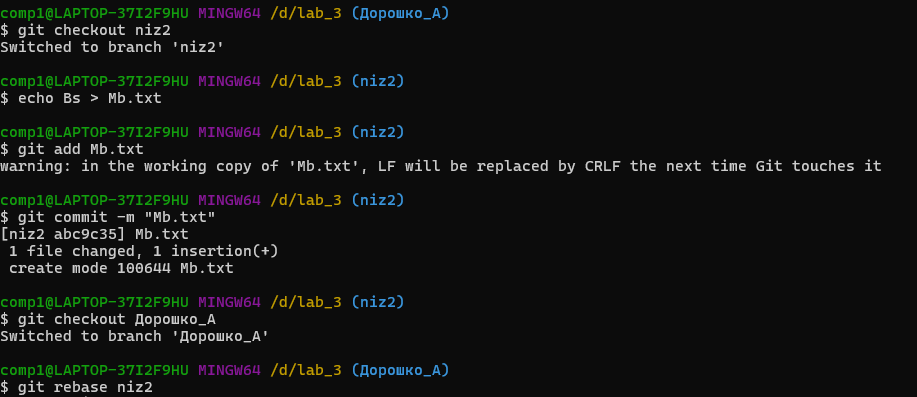

# Лабораторная работа №1
### ЦЕЛЬ
- Познакомиться с системой верстки текстов TeX, языком верстки TeX, издательской системой LaTeX.Выполнить вариант индивидуального задания.
### Условие
- Сверстать три страницы научной статьи с использованием системы верстки текстов TeX.
# Работа с LaTeX 

Для выполнения L1
Был использован Overleaf

Для регистрации можно перейти по ссылке:
[OverLeaf](https://www.overleaf.com)

*OverLeaf — онлайн редактор Latex* 
## Использованные пакеты Latex

Для работы в LaTeX нужно подключить специальные пакеты, в данной работе были использованы следующие:

```\usepackage{multicol} — Даёт возможность разделить страницу на 2 и более коллонны
\usepackage[left=2cm,right=2cm,top=1cm,botton=3cm]{geometry} — Настройка геометрии страницы
\usepackage{multicol} - Дает возможность создать колонки.
\usepackage{float} - Дает возможность вставить плавающие объекты.
\usepackage{parskip} - Вертикальный отступ.
```
## Лабораторная работа №3
### ЦЕЛЬ
- Познакомиться с программами git, освоить их программные аргументы.
### ВЫВОДЫ
- Научился на практике выполнять действия с репозиторием и отвечать на теоретические вопросы из списка заданий.
  ## Отчёт
1. создать локальный репозиторий в текущей папке <br>
)
2. посмотреть статус текущего репозитория <br>
3. что такое ветка и какая ветка является обычно основной: последовательность коммитов, main.
4. добавить файл в контекст, который будет коммититься <br>
5. cоздать коммит на основе текущего контекста и указать для него комментарий <br>
6. создать коммит, включающий изменения всех наблюдаемых файлов и указать для него комментарий <br>
7. посмотреть протокол(лог) коммитов <br>
8. посмотреть информацию о текущих настройках <br>
9. убрать файл из контекста <br>
10. посмотреть изменения в файле по сравнению с последним коммитом <br>
11. убрать изменения относительно последнего коммита из файла <br>
12. добавить в контекст коммита все измененные и созданный файлы <br>
13. изменить глобальные/локальные настройки: git config --global.
14. переписать имя пользователя <br>
15. просмотреть существующие ветки <br>
16. создать новую ветку <br>
17. переключиться на другую ветку <br>
18. создать новую ветку и сразу же переключиться на неё <br>
19. удалить ветку/удалить ветку, даже если она не примержена <br>
20. примержить изменения из указанной ветки в текущую <br>
21. в каком случае могут появиться конфликты? сделать конфликт: конфликт в случае слияния веток с разными изменениями в одном файле <br>
22. как посмотреть в каких файлах конфликты
23. как устранить конфликты: устранить конфликт вручную изменив файл до удовлетворительного состояния.
24. как переключиться на указанный коммит <br>
25. сделать ребазирование(rebase) текущей ветки <br>
26. устранение конфликтов во время ребазирования: устранить конфликт → git add {file} → git rebase --continue.
27. отменить ребазирование во время конфликтов: git rebase --abort.
28. пропустить текущий конфликтный коммит и перейти к следующему: git rebase --skip.
29. отправить изменения из локального репозитория для указанной ветки в удалённый(дистанционный) репозиторий: git push shared main.
30. забрать изменения из репозитория, для которого были созданы удалённые ветки по умолчанию <br>
31. забрать изменения удалённой ветки из репозитория по умолчанию, основной ветки: git pull origin {name}.
32. создание копии репозитория <br>
33. переименовать последний коммит <br>
34. переименовать не последний коммит: git rebase -i HEAD~n.
35. скрыть изменения по сравнению с последним коммитом: git revert HEAD.
- Получил практические навыки работы в консоли, использования консольных команд.
Получил практические навыки работы в консоли, использования консольных команд.
