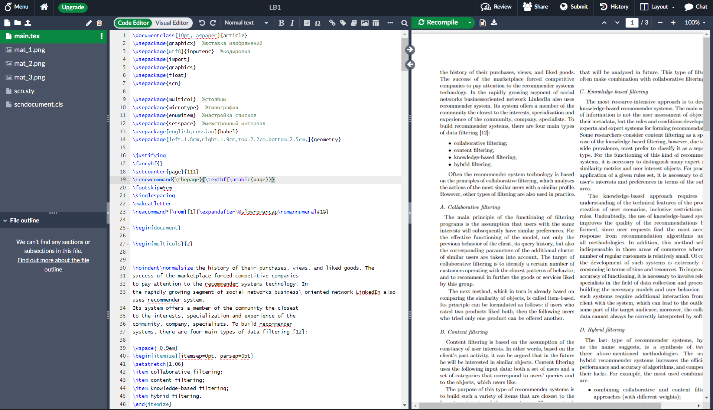

# Лабораторная работа №1

## Цели:

Познакомиться с: 
* системой верстки текстов TeX 
* языком верстки TeX
* издательской системой LaTeX 
Выполнить вариант индивидуального задания.

## Задание:

Сверстать три страницы научной статьи с использованием системы верстки текстов TeX. На [странице](https://proc.ostis.net/proc/Proceedings%20OSTIS-2024.pdf) необходимо взять доклад, соответствующий варианту индивидуального задания.
Для верстки документа рекомендованно использовать online ­редактор [Overleaf](https://www.overleaf.com) или любые другие LaTeX редакторы.

## Основные команды:

* `\usepackage`-подключение пакета
* `\multicols`- разбиение страницы на части(столбцы)
* `\par`-абзац
* `\columnbreak`-конец столбца
* `\begin{itemize}...\end{itemize}`- создание не пронумерованного списка

## Вывод 

* Познакомился с системой верстки текстов TeX, языком верстки TeX, издательской системой LaTeX.

# Лабраторная работа №3

## Цель работы:
* Познакомиться с программами git, освоить их программные аргументы.

## Задание:

* Получить практические навыки работы в консоли, использования консольных команд.
* Выполнить все [задания](https://docs.google.com/document/d/1pkqZWOlte5j6PuPpz7w03tPkw64ctuUwELoI-qctYVQ/edit?tab=t.0) и составить отчет по данной работе.

## Основные команды:

* `git init`- создание локального репозитория
* `git branch [name]`- создание ветки
* `git commit`- создание коммита
* `git add`- перенести файл из рабочего каталога в раздел проиндексированных файлов

## Вывод:

* Познакомился с программами Git, освоил их программные аргументы.

